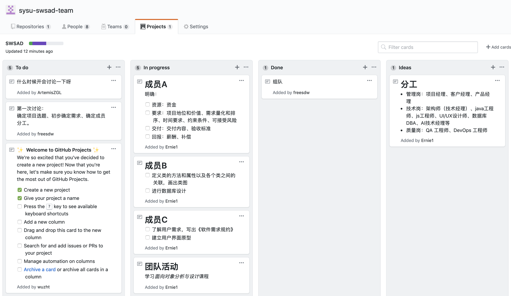

# 简答题
## 用简短的语言给出对分析、设计的理解。
- 分析

    强调的是对问题和需求的调查研究，而不是解决方案。
- 设计

    强调的是满足需求的概念上的解决方案（在软件方面和硬件方面），而不是其实现。

## 用一句话描述面向对象的分析与设计的优势。
便于在软件中构建更真实的虚拟世界。

## 简述 UML（统一建模语言）的作用。考试考哪些图？
描述、构造和文档化系统制品的可视化语言。
- 用例

    使用应用的情节或场景。
- 领域模型

    面向对象分析的结果。
- 交互图

    软件对象的职责和协作。
- 设计类图

    类的属性和方法。

## 从软件本质的角度，解释软件范围（需求）控制的可行性
软件范围对客户和开发者都是模糊的，软件本质的复杂性、不一致性、可变性、不可视性带来了范围控制的空间，可以先确认有效的功能与需求，砍去一些客户都没思考清晰的业务，再迭代不断满足客户需要，控制变化附加的成本，使得软件生产的预算、时间等能在掌控之中。

# 项目管理实践
## 看板使用练习

## UML绘图工具练习

（教材P9图1-6）