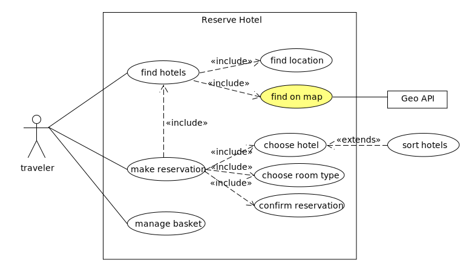

## 根据订旅馆建模文档，[Asg-RH.pdf](https://sysu-swsad.github.io/swad-guide/material/Asg_RH.pdf):
- 绘制用例图模型（到子用例）

- 给出 make reservation 用例的活动图

## 根据课程练习“投递员使用投递箱给收件人快递包裹”的业务场景
- 分别用多泳道图建模三个场景的业务过程

- 根据上述流程，给出快递柜系统最终的用例图模型
    - 用正常色彩表示第一个业务流程反映的用例
    
    - 用绿色背景表述第二个业务场景添加或修改的用例，以及支持 Actor
    
    - 用黄色背景表述第三个业务场景添加或修改的用例，以及支持 Actor
    